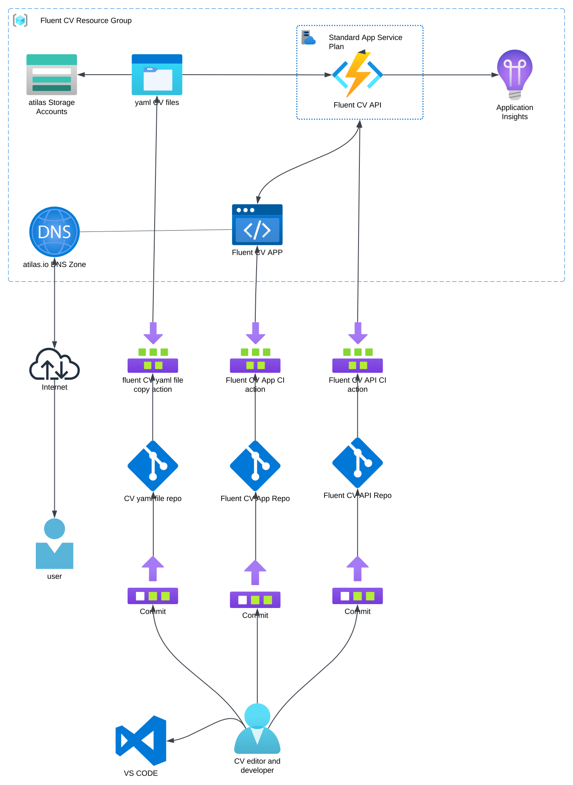

# Yet another CV builder/generator POC

- Writing a CV is the most boring thing ever.
- To have some fun during the process, built a rudimentary automated CV generator.
- The repo contains only the front-end part of the project

# Plan:

- Utilize Azure services:
    - Function App
    - Static Web App
    - DNS zone
    - Application Insights
    - Storage - File Share
- Create Front-end In different frameworks:
    - Angular 15 Next
    - Vue.js
- Use GitHub Actions for CI
- Use git submodules

# Results

- Setting up Azure was smooth.
    - there were some minor issues:
    - with free and pay-as-go plans
    - you can’t link multiple Static Web Apps for a single Function App (except if you disable the author set up some other type of auth)
- sadly, there is no free plan to separate Web API and Web App in Azure currently
- Failed to convert Angular tests to Jest - lets wait for the Angular next release

# Draft

